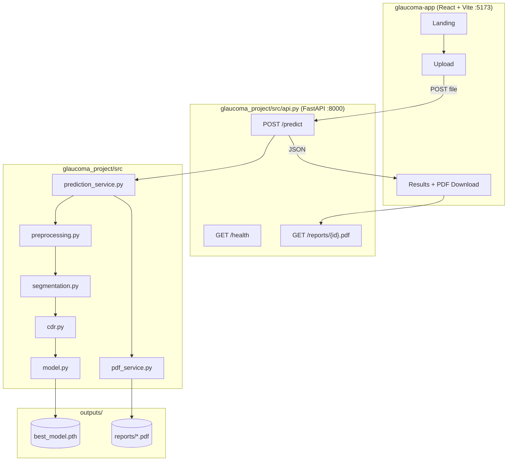

# Glaucoma Detection System — Architecture

## Canonical Architecture (v2)



## Request Flow

1. User uploads fundus image on `/upload`
2. Frontend sends `multipart/form-data` with field `file` to `POST /predict`
3. FastAPI saves temp file, calls `PredictionService.predict()`
4. Pipeline: preprocess → K-Strange segmentation → CDR → ResNet-50
5. `generate_medical_pdf()` writes to `outputs/reports/`
6. JSON response includes base64 images and `pdf_url`
7. Results page displays metrics; user downloads PDF

## Single Source of Truth

| Layer | Location | Notes |
|-------|----------|-------|
| API | `glaucoma_project/src/api.py` | Only backend |
| Inference | `glaucoma_project/src/prediction_service.py` | No Flask duplicate |
| PDF | `glaucoma_project/src/pdf_service.py` | Per-patient reports |
| Frontend | `glaucoma-app/` | Proxies to :8000 |

**Removed:** `glaucoma-app/flask-api/` (deprecated)

## API Response Schema

```json
{
  "prediction": "Glaucoma | Normal",
  "confidence_score": 0-100,
  "cup_disc_ratio": 0.0-1.0,
  "risk_level": "Low | Medium | High",
  "segmentation_images": { "original", "optic_disc", "optic_cup", "segmentation", "vessels" },
  "heatmap_image": "<base64>",
  "recommendations": [],
  "pdf_url": "http://localhost:8000/reports/GLC-XXXXXXXX.pdf"
}
```
